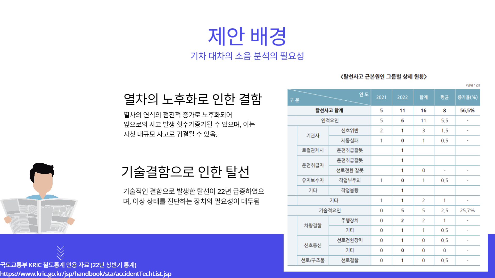

## 기차 대차의 이상 소음원 판별 프로젝트💡
<p>
  출근시간 열차지연 불편 뿐 아니라 인명/재산상의 피해를 발생시킬 수 있는 기차/열차 사고 사전에 막을 수는 없을까요?
</p>
<p align="center">
  
</p>

### 프로젝트 소개‼️
기차 대차의 소음을 분석하여 이상 소음원을 판별하고 이상 소음원의 
발생 지점을 찾아내는 2stage/3stage 방식의 프로젝트입니다. 

### 데이터 설명
<table>
    <tr>
        <td width="30%">
          <p align="center">
            
          </p>
        </td>
        <td width="30%">
            <p align="center">
              
            </p>
        </td>
    </tr>
    <tr>
        <td align="center">
          음향 센서에 기록된 약 80여개의 시험 운행 데이
        </td>
        <td align="center">
          multilabel데이터 특성상 많은 소리 요소가 포함된 MagnaTagATune데이터
        </td>
    </tr>
</table>

### 방법
1) 이상치 감지
<br> spectrogram으로 음향 정보를 변환하여 resnet18기반의 classification 모델로 이상 소음원 존재 유무를 판별합니다.

2) profiling
<br> channel97번의 트리거 신호를 이용하여 열차 속도를 추정하고,
<br> spectrogram을 db scale로 변환하여 horn발생이 최대가 되는 시간대를 찾아낸 후
linear regressor를 통해 이상 소음원의 위치를 추정합니다.

### 설치 및 실행
```bash
$ git clone https://github.com/IIP-LAB-TEAM/train_anomaly_detection.git
python -m venv .venv
[linux] python .venv/bin/activate
pip install -r requirements.txt
python -m source.main.inference.detect
```
### 팀 소개
<table>
    <tr>
        <td width="30%">
          <p align="center">
            
          </p>
        </td>
        <td width="30%">
            <p align="center">
              
            </p>
        </td>
    </tr>
    <tr>
        <td align="center">
           <table>
              <td>
               <div align="center">정지혁
              </td>
              <td>
                
              </td>
               <td>
                 
              </td>
            </table>
        </td>
        <td align="center">
           <table>
              <td>
               <div align="center">고재현
              </td>
              <td>
                
              </td>
               <td>
                 
              </td>
            </table>
        </td>
    </tr>
</table>

<table>
    <tr>
        <td width="30%">
          <p align="center">
            
          </p>
        </td>
        <td width="30%">
            <p align="center">
              
            </p>
        </td>
    </tr>
    <tr>
        <td align="center">
           <table>
              <td>
               <div align="center">김연진
              </td>
              <td>
                
              </td>
               <td>
                 
              </td>
            </table>
        </td>
        <td align="center">
           <table>
              <td>
               <div align="center">김태한
              </td>
              <td>
                
              </td>
               <td>
                 
              </td>
            </table>
        </td>
    </tr>
</table>
Author: jhCOR[TEAM IIP LAP(member: jhCOR, jaehyun-ko)]
